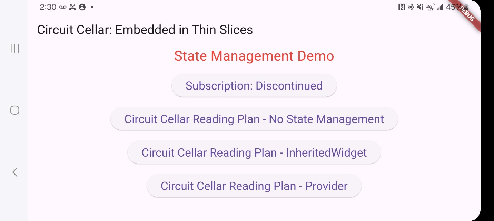

**Scope**

This repo contains a complete Flutter app to augment an April 2025 article in the Embedded in Thin Slices column in the magazine [Circuit Cellar.](https://circuitcellar.com/category/article-materials-and-resources/) This app is intended to be used to demonstrate and illustrate State Management.

**Usage**

The opening screen contains buttons that each illustrate a method of state management:

1.  Subscription Button – illustrates simple usage of State
2.  No State Management Reading Plan – illustrates how the check button without the function *setState* does not set the checkbox. Once *setState* is uncommented out, it illustrates how the Progress bar is not updated with some form a State Management.
3.  InheritedWidget Reading Plan – illustrates how you can use the built in State Management in Flutter to communicate between widgets
4.  Provider Reading Plan – illustrates how you can use a add-on package (Provider) to provide State Management
5.  
